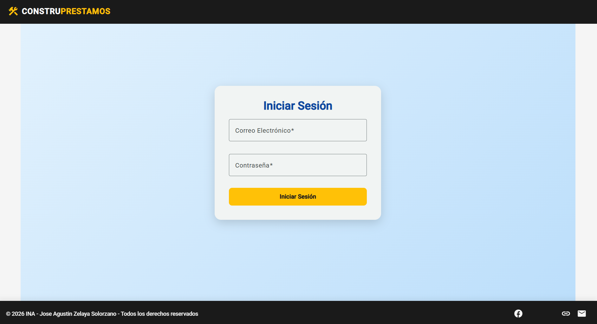
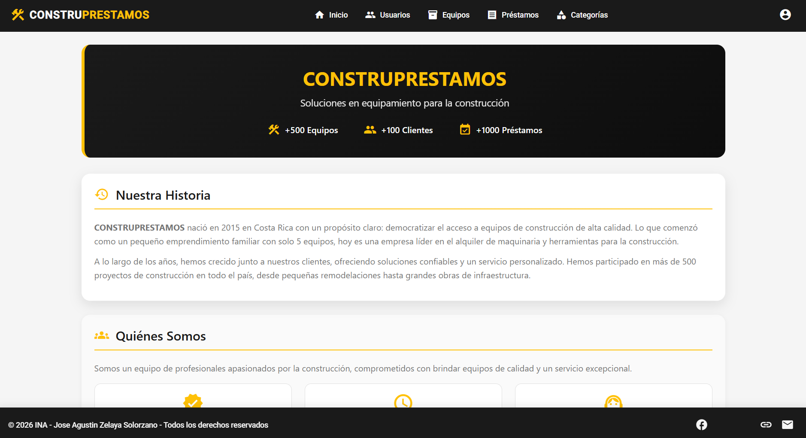
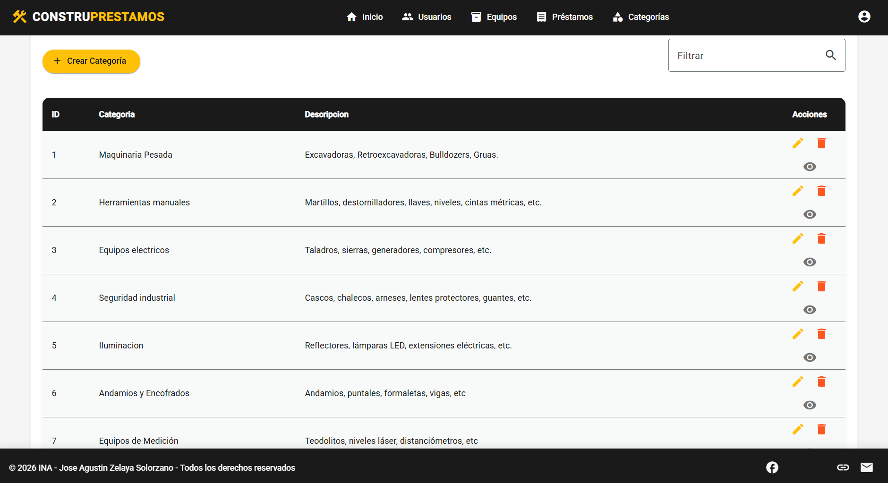
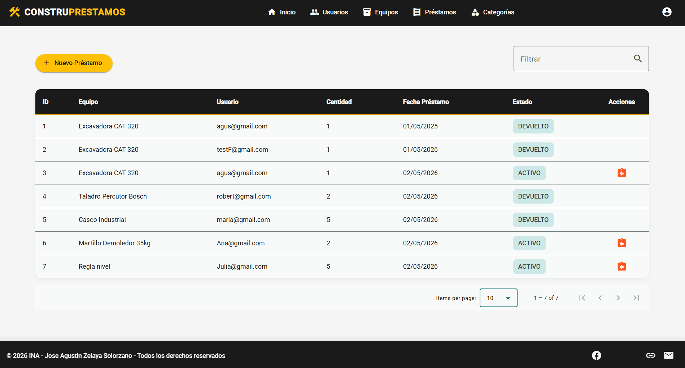

# INA App - Sistema de Gestión de Prestamos de Equipo de Construccion

# Autor:
José Agustín Zelaya Solórzano
  - GitHub: @atteaguz

Sistema de gestión desarrollado como asignacion de comprobacion INA - Costa Rica.

## Tecnologías utilizadas

### Frontend
- Angular 21
- Angular Material
- TypeScript
- Signals

### Backend
- Node.js
- Express
- TypeORM
- MySQL
- JWT para autenticación

## Funcionalidades

- ✅ Autenticación de usuarios (login/logout)
- ✅ CRUD de Usuarios
- ✅ CRUD de Categorías
- ✅ CRUD de Equipos
- ✅ CRUD de Prestamos
- ✅ Control de roles (admin/user/funcionario)
- ✅ Dashboard/Inicio
- ✅ Diseño responsivo con Angular Material

## Capturas

- LogIn 
- Dashboard 
- Categorias 
- Equipos 
- Prestamos 

## Instalación y configuración

### Requisitos previos
- Node.js (v18 o superior)
- MySQL
- Angular CLI

### Backend
- cd API
- npm install
- npm run dev

